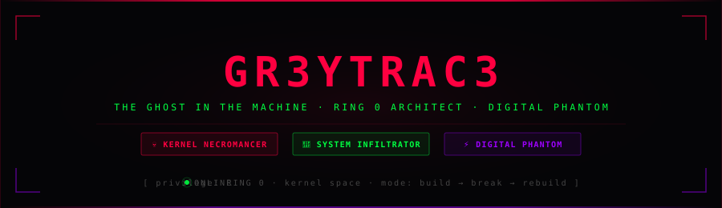

<div align="center">

<!-- DARK HEADER PANEL (SVG in repo — supports dark bg, custom styles) -->


</div>

---

<!-- PRIVILEGE STATUS PILLS -->
<div align="center">


</div>

---

## `> IDENTIFICATION PROTOCOL`

```
┌─────────────────────────────────────────────────────────────────────┐
│  root@ring0:~# whoami                                               │
│                                                                     │
│  > Offensive Kernel Security Engineer/Researcher — in the making.   │
│  > Passionate about the core of systems: breaking them apart,       │
│    building them back stronger,and documenting.                     |
│                                                                     │ 
│  root@ring0:~# cat /proc/philosophy                                 │
│                                                                     │
│  "To break the system,                                              │
│   I become the system."                                             │ 
│                                                                     │
│  Operating beyond detection.                                        │
└─────────────────────────────────────────────────────────────────────┘
```

---

## `> SPECIALIZATION STACK`

<div align="center">

| Module | Domain | Status |
|--------|---------|--------|
| `kernel_exploit.c` | Linux Kernel Exploitation · CVE Research |  |
| `fuzzer.py` | AFL++ · Syzkaller · Vulnerability Discovery |  |
| `syscall_tracer.s` | Syscall Analysis · Rootkit Engineering |  |
| `ebpf_weapon.bpf.c` | eBPF-based Surveillance · Weaponization |  |
| `ring0_implant.c` | Kernel-Level Implant Research |  |
| `redteam_ops.sh` | Red Team Ops · Kernel-Level Access |  |
| `reveng.asm` | Reverse Engineering · Debugging |  |

</div>

---

## `> LANGUAGE ARSENAL`

<div align="center">


</div>

---

## `> CURRENT FOCUS`

```python
focus = {
    "kernel_internals": [
        "Building & debugging kernels (QEMU/KVM, Proxmox)",
        "Sanitizer-driven triage: KASAN, UBSAN",
        "Deterministic debugging with kgdb",
    ],
    "low_level_mastery": [
        "C language internals & memory model",
        "x86_64 and ARM64 assembly",
        "Python & Bash for automation, tooling, analysis",
    ],
    "ongoing": [
        "Reverse Engineering & analysis",
        "Deep learning & exploitation research",
        "Solving Reverse Eng challenges and deep Linux mastery",
        "Tooling, built from scratch and working on projects"
    ]
}
```

---

## `> STATS`

<div align="center">


</div>

---

<div align="center">


<br/>


</div>
